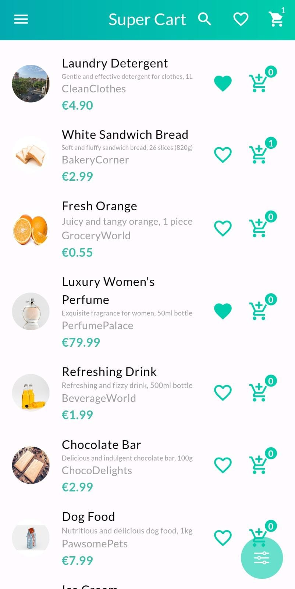
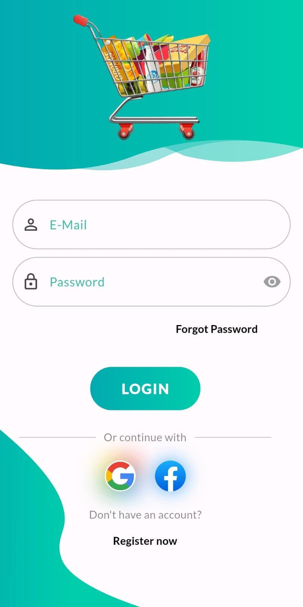
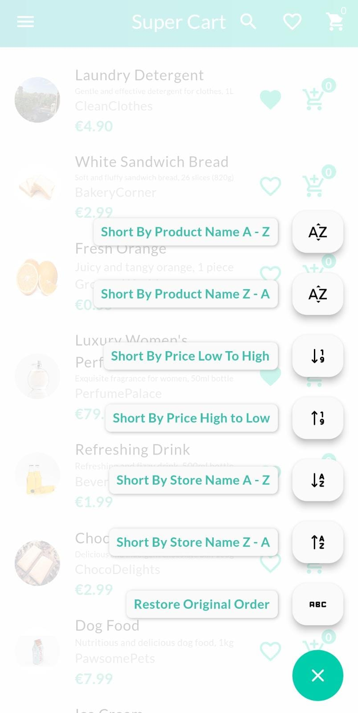
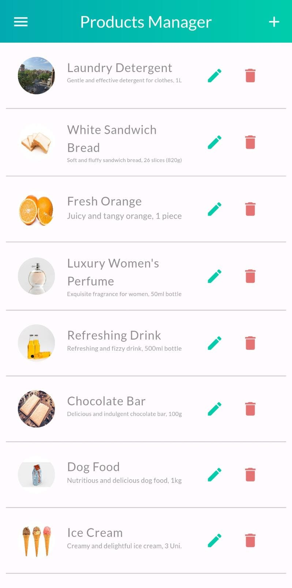
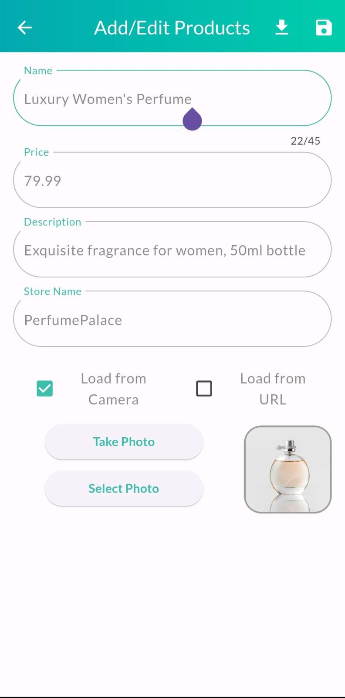
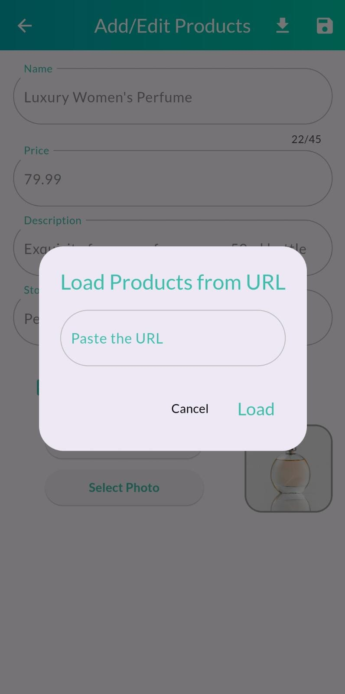
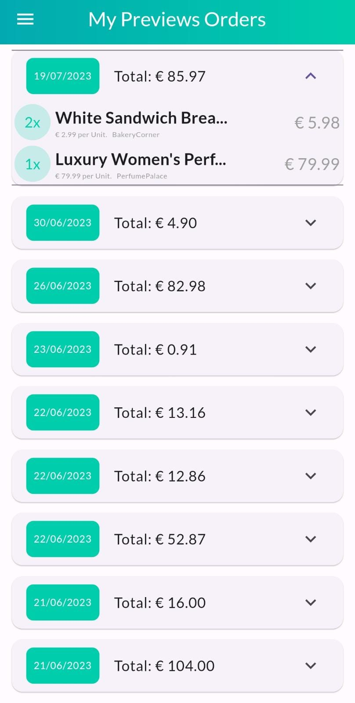
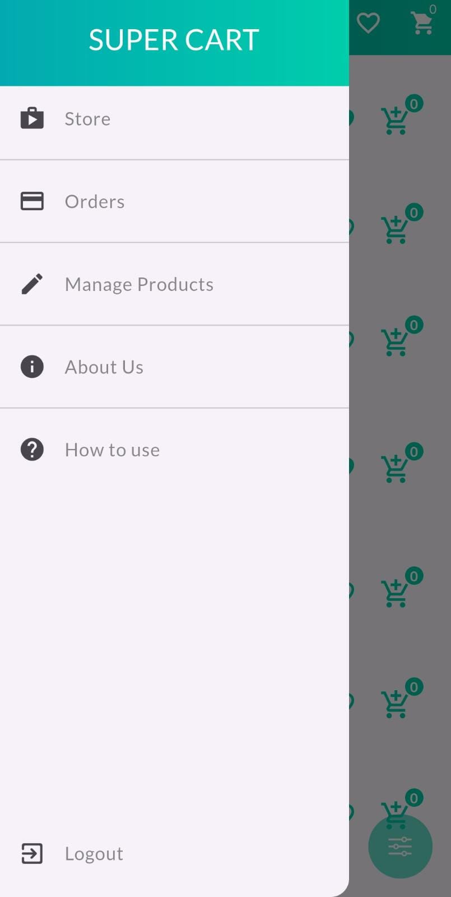
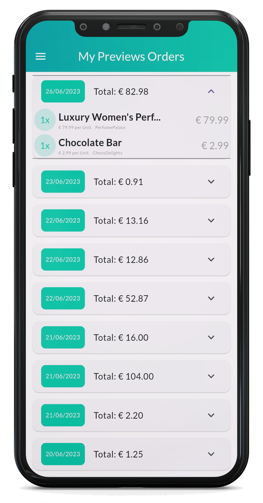
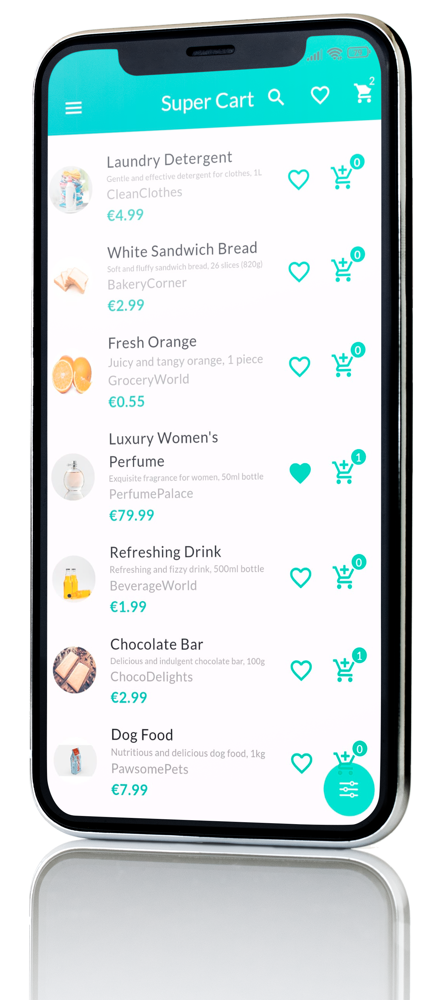

Store App
This is a front-end application designed to allow any store to generate a URL with formatted JSON products. Users can load and view these products using the generated URL, as well as create their own products by uploading images from the web or their device gallery. The primary objective is to eliminate the need for a private application for showcasing store products. In addition to viewing and adding products to the cart, users can also edit existing products and view past orders.

Features
Product Display:

The app allows users to load and view products from a URL containing formatted JSON content.
Users can browse through different products offered by the store.
Each product is displayed with essential details such as image, name, and price.
Product Management:

Users have the ability to create their own products.
Product creation involves uploading an image, providing a name, and specifying the price.
Users can edit the name and price of existing products to correct and refine the information.
Cart Functionality:

Users can add products to their cart for future purchase.
The app provides a cart feature where users can review the selected products.
Users can remove products from the cart if needed.
Order Placement:

Once users have added products to their cart, they can proceed to place an order.
A "Buy" button allows users to finalize their purchase and generate an order.
Order history is maintained for users to review their past purchases.
Backend Configuration
To use the Store App, you need to configure the backend methods responsible for handling data storage, retrieval, and order processing. The app assumes the use of Firebase as the backend service, but you should replace the placeholder code with your own Firebase configurations and API keys.

Create a Firebase project:

Go to the Firebase Console and create a new project.
Enable the necessary Firebase services such as Firestore for data storage and Firebase Authentication for user management.
Configure Firebase in the app:

In the project codebase, locate the Firebase configuration file (e.g., firebaseConfig.js).
Replace the placeholder values with your Firebase project's configuration details.
Ensure the app is connected to your Firebase project by verifying the configuration.
Implement backend methods:

Create the necessary backend methods or APIs to handle product storage, retrieval, and order processing.
These methods should interact with the Firebase services and database to perform the required operations.
Replace the placeholder backend method calls in the app with your own implementation.
Installation
To use the Store App, follow these steps:

Clone the repository to your local machine.
Install any necessary dependencies by running npm install.
Start the application using npm start.
Access the app through your web browser at the provided URL.
Usage
Home Page:

Upon opening the app, you will be directed to the home page.
The home page displays the products available from the store's URL.
Product Details:

Click on a specific product to view more details.
The details include the product image, name, and price.
Creating a New Product:

Click on the "Create Product" button to add a new product.
Upload an image for the product and provide the name and price.
Save the product to make it available for viewing and purchase.
Editing a Product:

To edit an existing product, navigate to the product details page.
Click on the "Edit" button.
Update the necessary information such as the name or price.
Save the changes to update the product.
Cart Management:

To add a product to the cart, click on the "Add to Cart" button on the product details page.
To view the cart, click on the "Cart" button in the navigation menu.
Remove products from the cart by clicking the "Remove" button next to each item.
Placing an Order:

Ensure the desired products are added to the cart.
Open the cart page and click on the "Buy" button.
A new order will be generated, and you can view it in the order history.
Contributing
Contributions to the Store App are welcome! If you encounter any bugs, have feature requests, or would like to make improvements, please submit an issue or a pull request to the GitHub repository.

License
This project is licensed under the MIT License. Feel free to use, modify, and distribute the code as per the license terms.

